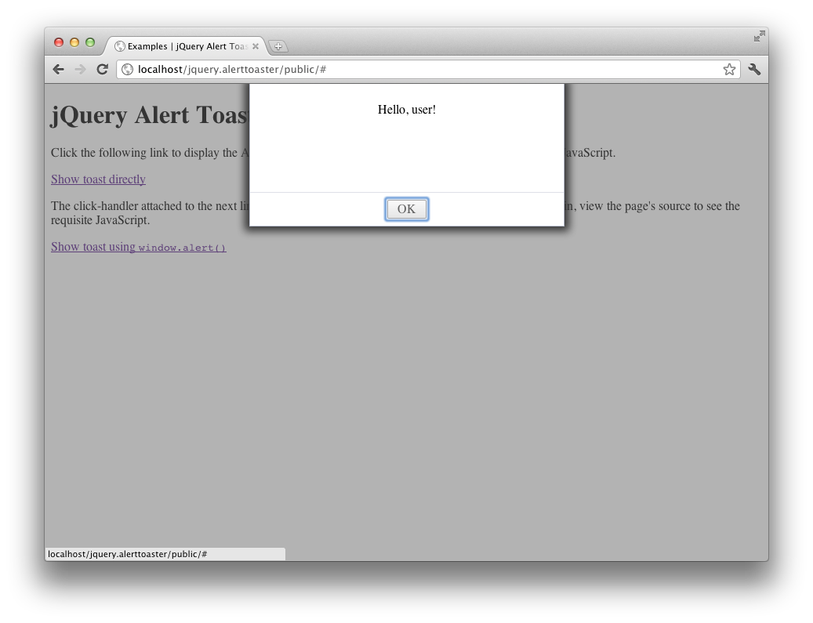

# jQuery Alert Toaster #

jQuery Alert Toaster is a jQuery plugin that displays alerts on a Mac OS X-style slide-down sheet.

## Instructions ##

1. Load the JavaScript and CSS in the plugin's `public` directory in the head of your page - you need only install the
contents of the `public` directory on your webserver.
1. Greet the world with `jQuery.alertToaster.showAlert('Hello world!');`

Open `<plugin root>/public/index.html` in your browser to see some more examples.